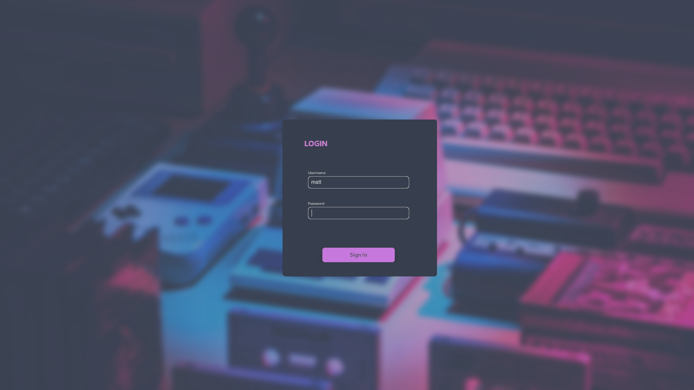
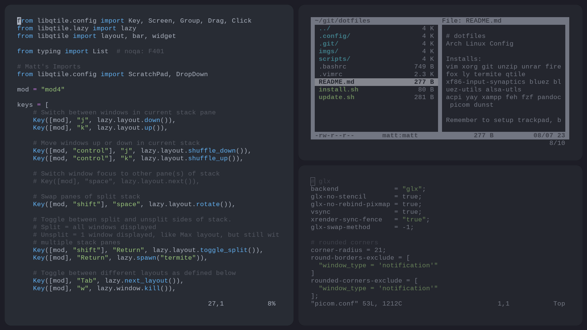

# dotfiles

     
My Custom Arch Linux Install

## Packages
vim xorg git unzip unrar firefox ly termite qtile 
xf86-input-synaptics bluez bluez-utils alsa-utls 
acpi yay xampp feh fzf pandoc picom dunst

## Additional Notes
* Remember to setup trackpad, bluetooth, and audio!

 
<h4 align="center">Preview</h4>

  
  

